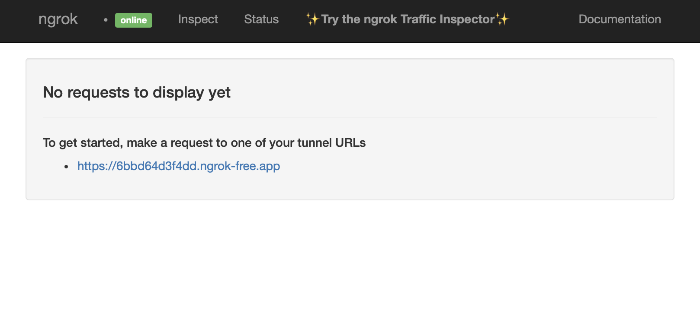
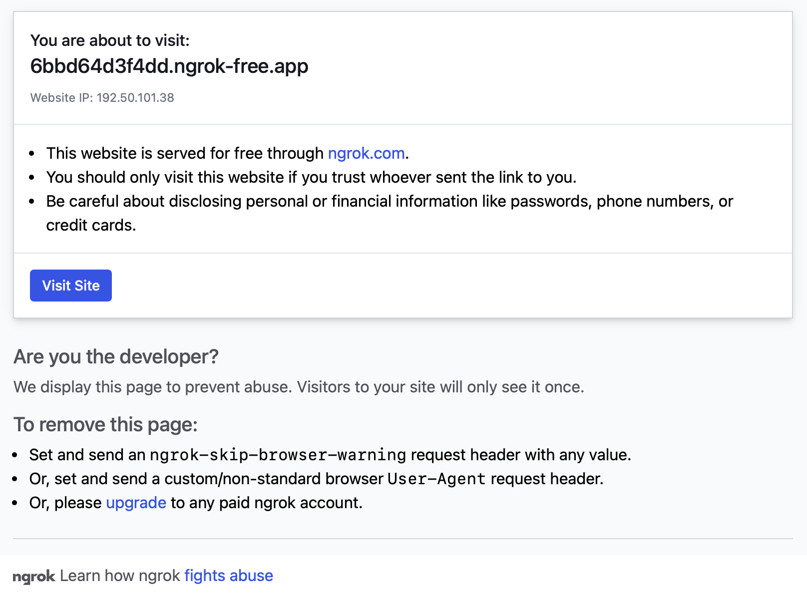

# Team-12 API(アジフライ・パセリ・イカリング)

## チーム情報
- チーム番号: 12
- チーム名: API(アジフライ・パセリ・イカリング)
- プロダクト名: holo
- メンバー: 明石詩歩 ([@uta1018](https://github.com/uta1018))、泉知成 ([@Tomopu](https://github.com/Tomopu))、新免友基 ([@shimmen3141](https://github.com/shimmen3141))、鈴木智優 ([@CShoku](https://github.com/CShoku))、幸坂舞優 ([@maiyu-u](https://github.com/maiyu-u))

---
## デモ / プレゼン資料 (決勝発表用)
- デモURL: [デモアプリ (Cloud Run デプロイ済み)](https://front-app-708894055394.asia-northeast1.run.app/)
- プレゼンURL: [プレゼン共有リンク (決勝発表用)](https://www.canva.com/design/DAGyvV7xHEw/HdBF_WemKPQ5FikKThroBQ/view?utm_content=DAGyvV7xHEw&utm_campaign=designshare&utm_medium=link2&utm_source=uniquelinks&utlId=he880c6234f)

## デモ　/ プレゼン資料 (予選発表用)
- デモURL: [デモ動画 (予選発表用)](https://drive.google.com/file/d/1O-P8ADvdTSPMdaQi1md53s76T8jFakQn/view?usp=share_link)
- プレゼンURL：[プレゼン共有リンク (予選発表用)](docs/slide_backup/EGH_202509_予選.pdf)


## 開発環境の構築方法
- [開発環境の構築方法に関するマニュアルはこちら](./docs/dev_environment.md)

## 本番環境の実行方法
### 1. 環境構築
本システムでは、Docker(コンテナ仮想環境用プラットフォーム)を用いて、サーバーを作成・起動します。
以下のサイトから、サーバーとして使用するマシン(ホストマシン)のOSに対応したDockerの環境をダウンロードしてください。
- [Download Docker Desktop (macOS or Windows)](https://www.docker.com/products/docker-desktop/)
- [Install Docker Engine on Ubuntu (Docker Docs)](https://docs.docker.com/engine/install/ubuntu/)

### 2. 本システムのダウンロード
以下のコマンドを実行して、リモートリポジトリ(本システム)をローカル環境にクローンしてください
```bash
git clone https://github.com/Engineer-Guild-Hackathon/team-12-app.git
```

### 3. ngrokの準備
ダウンロードしたリポジトリ(ディレクトリ)に移動します。
```bash
cd team-12-app
```
次に、ローカルPC上で稼働しているネットワークサービスを一時的に外部公開するために、**ngrok** の設定を行います。
以下のURLにアクセスをして ngrok のアカウントを作成し、"**Your Authtoken**" に記載されたトークンをコピーしてください。
- [https://dashboard.ngrok.com/get-started/your-authtoken](https://dashboard.ngrok.com/get-started/your-authtoken)


(※ 画像に記載されている Authtoken はリセット済みのトークンです。)

以下のコマンドで、`.env` ファイルを作成してください。
```bash
echo "NGROK_AUTHTOKEN=" > .env
```
ここで、`"NGROK_AUTHTOKEN="`の後に、先ほどコピーした  "**Your Authtoken**" をペーストしてください。  
(例: `echo "NGROK_AUTHTOKEN=2cIHkuYm25kstGM8KYPRURvwcx4_hjpuihXXZbZtXwg3oJP1" > .env`)

以下のコマンドで、`NGROK_AUTHTOKEN=あなたのトークン` が表示されたら設定が完了です。
```bash
cat .env
```

### 4. 実行
以下のコマンドを実行して、サーバーを作成・起動します。
このとき、macOSやWindowsを使用している場合は、Docker Desktopアプリを起動した状態で実行してください。

```bash
docker compose -f compose.yaml -f compose.prod.yaml up -d --build
```
以下のコマンドで、サーバーが正常に作動したかを確認します。
```bash
docker ps
```
出力結果の `STATUS` の項目が、4つとも全て "Up 37 seconds"のような表示になっていれば、正常にサーバー(コンテナ)が起動している状態です。

```bash
CONTAINER     ...  STATUS         ...  NAMES
33e7ff60cdc5  ...  Up 37 seconds  ...  ngrok-server
6c0256b3caa6  ...  Up 37 seconds  ...  postgre_db
4dd59930164b  ...  Up 37 seconds  ...  front-app
6fbea7d9a0f9  ...  Up 37 seconds  ...  back-server
```

### 5. サイトへのアクセス
[http://localhost:4040](http://localhost:4040) にアクセスすると、以下の写真のような ngrok の画面に移動します。
`"To get started, make a request to one of your tunnel URLs"` という項目の下に、本システムのサイトページにアクセスするための URL がランダムに生成されています。(例：`https://6bbd64d3f4dd.ngrok-free.app`)

このランダムに生成されたURLを他の人に共有することで、誰でもサイトのページにアクセスすることができます。



リンクにアクセスをすると以下の画面が表示されるため、[**Visit Site**]を押すことでサイトを表示することができます。




#### 6. サーバーを削除する
最後に、デモが終了した後は、以下のコマンドを実行してサーバー(コンテナ)を終了・削除します。

```shell
docker compose -f compose.yml -f compose.prod.yml down
```

実行結果が以下のように、4つのコンテナと1つのネットワークが削除(Removed)となれば、サーバーの削除は完了です。

```shell
[+] Running 5/5
 ✔ Container postgre_db         Removed    0.3s
 ✔ Container ngrok-server       Removed    0.3s
 ✔ Container back-server        Removed    0.3s
 ✔ Container front-app          Removed    0.2s
 ✔ Network team-12-app_default  Removed    0.1s
```
再度、サーバを作成・起動する場合は、「**4. 実行**」から同じ手順を進めてください。


