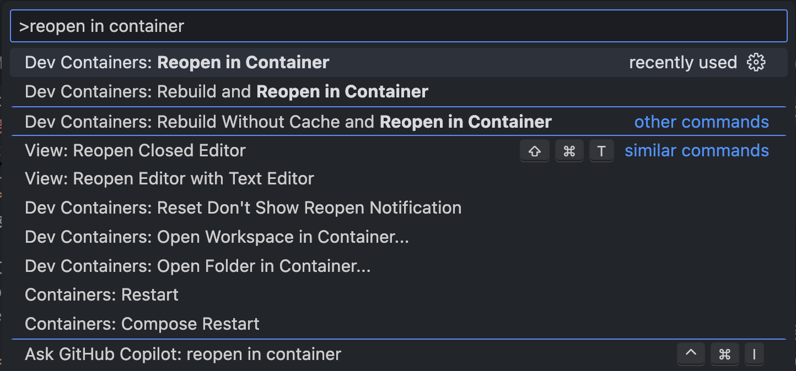
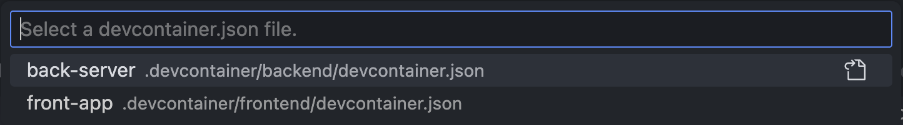
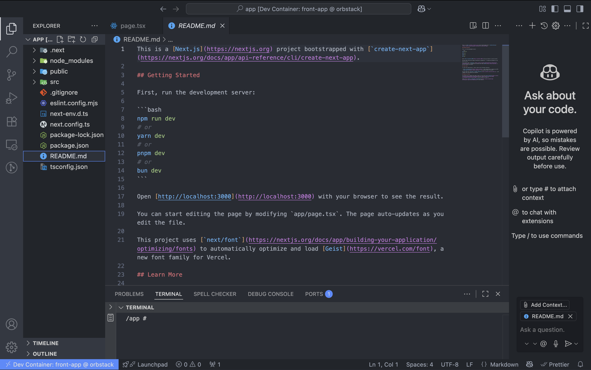
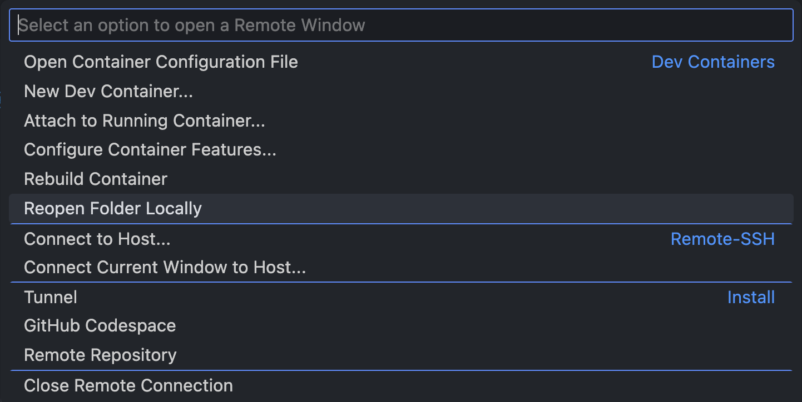

# 開発環境構築

作成日：2025年9月8日(月)  
作成者：泉知成 (@Tomopu)

## 開発環境
| 項目 | 説明 |
| ---- | ---- |
| エディタ | Virtual Studio Code (VSCode) |
| 開発ツール | Git + Docker + DevContainer |
| 開発言語・フレームワーク | Flask 3.1.0  (Python 3.12.11), Next.js 15.5.2 (TypeScript 5.9.2) |
| データベース | PostgreSQL |

## 0. 前準備
### 0-1. Dockerの環境構築
本システムでは，Dockerを用いて仮想コンテナを作成・起動します。 以下のサイトから，ホストマシンのOSに対応したDockerの環境をダウンロードしてください。
- [Download Docker Desktop (macOS or Windows)](https://www.docker.com/products/docker-desktop/)
- [Install Docker Engine on Ubuntu (Docker Docs)](https://docs.docker.com/engine/install/ubuntu/)
- [macOS専用 軽量版 Docker Desktop (OrbStack)](https://orbstack.dev)

### 0-2. Dev Containersの環境構築
**Dev Containers** という拡張機能をVSCode内でダウンロードしてください。
(Dev ContainersではなくRemote Development でも可。)
- [Dev Containes (Visual Studio Marketplace)](https://marketplace.visualstudio.com/items?itemName=ms-vscode-remote.remote-containers)

`.devcontainer/*/devcontainer.json` に、開発コンテナに対してダウンロードするVSCodeの拡張機能が設定されています。
ここに設定した拡張機能は、他の人のVSCode(仮装環境)にも自動でダウンロードされます。
必要な拡張機能があれば、適宜追加してください。
```json
{
    "customizations": {
        "vscode": {
            "extensions": [
                "ms-python.python",
                "oderwat.indent-rainbow",
                "ms-ceintl.vscode-language-pack-ja",
                "ms-python.black-formatter",
                "samuelcolvin.jinjahtml",
                "tamasfe.even-better-toml"
            ]
        }
    }
}
```

### 0-3. Google Cloud CLI のインストール
#### macOS (Apple Silicon / ARM)の場合
1. Google Cloud CLI のアーカイブをダウンロード
```bash
curl -O https://dl.google.com/dl/cloudsdk/channels/rapid/downloads/google-cloud-cli-darwin-arm.tar.gz
```
2. ダウンロードしたアーカイブを展開
```bash
tar -xf google-cloud-cli-darwin-arm.tar.gz
```
3. インストールスクリプトを実行
```bash
./google-cloud-sdk/install.sh
```
4. シェルを再起動
```bash
source ~/.zshrc
```
5. 初期化 (アカウント認証・プロジェクト設定など)  
ブラウザに移動し、Googleアカウントへのログインが求められます。
```bash
./google-cloud-sdk/bin/gcloud init
```
6. ADC (Application Default Credentials) の生成
```bash
gcloud auth application-default login
```
7. ADC のパスを .env に書き出す  
プロジェクト (`team-12-app`) のルート直下に移動して、.envに書き出してください。
```bash
echo "ADC_JSON=$HOME/.config/gcloud/application_default_credentials.json" >> .env
```

#### Windows (PowerShell)
1. PowerShell を管理者権限で開く
2. 以下のコマンドを実行し、インストーラをダウンロード＆実行

または、[Google Cloud SDK インストーラ](https://dl.google.com/dl/cloudsdk/channels/rapid/GoogleCloudSDKInstaller.exe?hl=ja)をダウンロード
```shell
Invoke-WebRequest "https://dl.google.com/dl/cloudsdk/channels/rapid/GoogleCloudSDKInstaller.exe" -OutFile "GoogleCloudSDKInstaller.exe"
Start-Process ".\GoogleCloudSDKInstaller.exe"
```
3. インストーラの指示に従ってインストールを完了する
4. インストール完了後、PowerShell を再起動して gcloud init を実行  
ブラウザに移動し、Googleアカウントへのログインが求められます。
```shell
gcloud init
```
✅ インストーラで「パスを通す」オプションを選択すると、再起動後すぐに gcloud コマンドが利用できるようになります。

5. ADC (Application Default Credentials) の生成
```shell
gcloud auth application-default login
```
6. ADC のパスを gcloud.adc.env に書き出す (PowerShell)  
プロジェクト (`team-12-app`) のルート直下に移動して、`.env`に書き出してください。
```shell
"ADC_JSON=$env:APPDATA\gcloud\application_default_credentials.json" >> gcloud.adc.env
```

- 詳しいインストールの説明はこちらから：[gcloud CLI をインストールする | Google Cloud SDK](https://cloud.google.com/sdk/docs/install?hl=ja#windows)


## 1. リモートリポジトリをクローン
以下のコマンドを実行して，リモートリポジトリをローカル環境にクローンする。
```bash
$ git clone https://github.com/Engineer-Guild-Hackathon/team-12-app.git
```

## 2. 開発コンテナを作成して立ち上げる
VSCodeの「コマンドパレット」を F1キー(または**Windows／Linux**では **`Ctrl＋Shift＋P`**，**macOS**では **`Command＋Shift＋P`**) で立ち上げ，以下のコマンドを入力します。

(初回は必ずネットワーク環境下で実行してください。)
```bash
> reopen in container
```
- **日本語**:「開発コンテナー: コンテナーを再度開く」
- **英語**:「Dev Containers: Reopen in Container」



次に、起動する開発コンテナーを選択すると、コンテナが立ち上がり、コンテナ内がVSCode上に表示されます。
 - バックエンドの開発 → **back-server**
 - フロントエンドの開発 → **front-app**


以下のような画面になると成功です。
コンテナ内で編集した内容は、ファイルをセーブすることで、ホスト側の同じファイルにも自動で反映されます。



**注意:**
初回はDocker Hubから仮想コンテナのイメージをダウンロードするため、開発コンテナの作成に時間がかかります。

## 3. サーバーを明示的に起動する
### バックエンド側 (in back-server)
以下のコマンドを実行すると、Flaskのサーバーが起動します
```bash
python app.py
```

実行結果が以下のように表示されたら、サーバーの起動は成功です。
この場合、[http://192.168.97.3:5000](http://192.168.97.3:5000) でバックエンド側のサイトにアクセスできます。

```bash
 * Serving Flask app 'app'
 * Debug mode: on
WARNING: This is a development server. Do not use it in a production deployment. Use a production WSGI server instead.
 * Running on all addresses (0.0.0.0)
 * Running on http://127.0.0.1:5000
 * Running on http://192.168.97.3:5000
Press CTRL+C to quit
 * Restarting with stat
 * Debugger is active!
 * Debugger PIN: 972-751-179
```

### フロントエンド側 (in front-app)
以下のコマンドを実行すると、Next.js のサーバーが起動します。
(コンテナを起動した時点で、自動的にサーバーは立ち上がっている。)

```bash
npm run dev
```
実行結果が以下のように表示されたら、サーバーの起動は成功です。
この場合、[http://localhost:3000](http://localhost:3000) でフロントエンド側のサイトにアクセスできます。

```bash
▲ Next.js 15.5.2 (Turbopack)
 - Local:     http://localhost:3001
 - Network:   http://192.168.97.2:3001

 ✓ Starting...
 ✓ Ready in 751ms
```

## 4. コンテナから抜け出す
**注意:**
Git の操作はコンテナ外で行ってください。

コンテナ内での作業を終了する場合、VSCode左下の**青い四角** (**`Dev Container: back-server/front-app`**) をクリックし、「Reopen Folder Locally」を選択することで、コンテナの外側に出ることができます。


↓


## 5. コンテナの停止・削除
以下のコマンドを実行することで、コンテナを停止・削除することができます。

### コンテナを停止する場合
```bash
docker compose -f compose.yaml -f compose.dev stop
```

### コンテナを停止＋削除する場合
```bash
docker compose -f compose.yaml -f compose.dev down
```

