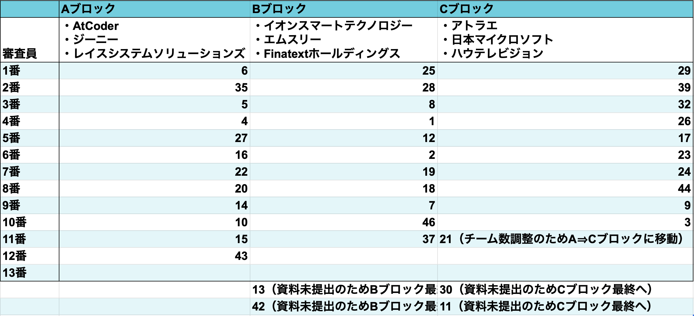
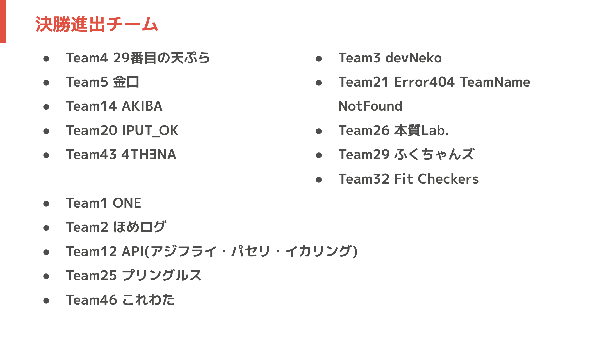

# 予選発表講評 (全体)

作成日：9月13日(土) 16:40~17:00

## 作成者
泉知成

## 予選発表グループ一覧

## 決勝進出チーム

## AtCoder さん (Aブロック担当)
> ハッカソンやるたびに「短時間でよくそこまで出来るなあ」って思うことが多いなあ。講評もさせてもらったけど、ばんくしさんのコメント聞くと、ばんくしさんは技術者で自分は経営者だなあ、というのをめっちゃ感じるなどした。結構視点が違いそうな感じ。
>(高橋 直大さん　Twitter引用)

> 自分は「どれだけ売れるか」を評価指標に置くことはないんだけど、「世の中の10人がめっちゃ喜ぶか」は割と重要な評価指標で、「このサービスに狂喜乱舞するサービスが10人いる」って確証が持てるまでは技術には触れないでいいと思うんだよね。ちょっと実装に移行するのが早くない？と思ってた　#EGH
> (高橋 直大さん　Twitter引用)

> CI/CD環境についての話については、企画提案のためのプロトタイプの後じゃないのかなあ、と思っていて、そこが出来てると技術に使える時間が減って完成度上がるよね、って話はこのフェーズにおいては微妙？
> ……が、「そこを手癖で出来るくらい開発に慣れている」ってのはめっちゃアドではあるよね。
> (高橋 直大さん　Twitter引用)

- 1週間でここまで作ってきたの！？が率直な感想
- それを前提として、
- エンジニアは技術が好きな人が前提で、ハッカソンでもそれをみたい人が多いから動くものを作ってきた人たちが多かった
- ただ、わざわざ予選を用意している意味を考えて欲しい
- 予選では、「これができますよ」っていう予告が欲しい。
- このまま行くと、こんな未来が待っているというビジョンの部分を予選では見せて欲しいのに、そこが小さくまとまってしまったチームが多かった。
- 動くところに力を少し入れすぎ。技術に基づいているのもいいし、ちゃんと動くのはいいんだけど...。
- ボトムアップではなく、10になったら嬉しいですよねをドンと
- ペルソナを出して、解決方法はこれだ！！を見せてくれないと、動かないデモとか見せられても本当に面白いかが全然わからない
- ペルソナとして設定した人が、究極的に欲しいものは何か、それが実現してどうなるかが見えなかったチームが落選している
- これができたら面白いなと、ワクワクが溢れるチームが予選を通過していた。
- 決勝はワクワクだけではなくて、動くものを作って欲しい。
- **ただ、できたところはできて、できなかったところはこれからでも、ちゃんと評価するつもり。**
- どこを目指すかをはっきりしないと、プロダクトとして成功しないから気をつけるように。
- これが今までなかったから、これができることで新たな価値を産むんだ！！というところをしっかりと。
- 予選落ちたチームは、完成してなくていいし、動かなくていいから、モックをちゃんと作って欲しい。
- プレゼンは文字で見せられても伝わらないし、かといってバックエンドまで作り切るのは難しい。
- AIが音声で返すのができあがらないんだったら、自分の声を録音してもいい
- 最終成果物の前にモックというものがある。
- 決勝については、**ハッカソンはアイデアを競う部分ではなく、ここからここまで完成したが勝負。**
- 100%作り切るよりは、ビジネスモデルなども評価に入る。2週間で作れる限界はあるし。ただ手を抜いていい訳ではない。
- **0→1 と 1→100 があるとき、1を見せて100をプレゼンでっていうのを決勝で見せて欲しい。**
- **新規登録とログインができないとか、動かないなどは完成度が0点**
- **決勝戦は審査員が触れるものをマストでやって。** 過去はサーバーをラズパイで建ててホスティングしている人もいた。

## エムスリーさん
### 実用性と創造性
- 今回「学び」がテーマだったが、みなさんとても良かった。
- 特に、身近な課題から想起してソリューションを考えるのは非常に重要。
- 自分たちが知らない課題を「面白そうだから」「儲かりそうだから」で解こうとすると失敗する。
- 例えば、「サッカー選手の靴にローラースケートをつければいいのでは！？」
- 実際の社会でも、そういった失敗するソリューションはあったりする。
- やっていくうちに、自分たちが知らない課題に触れる機会を失って、歪なソリューションを作るはよくある。
- エムスリーでも、エンジニアが病院に行って実際に課題を体験したり、営業と同行したり、製薬企業から直接話を聞く、幹部と話をするなどして、やっと製品開発ができる。
- 自分たちのエピソードをちゃんと語っていたチームは決勝に進んでいたし、課題解決法や技術選定を間違えていなかった。
- ほとんどのチームはできてたよ。
- 一方で、実用性・創造性で突き抜けるのは難しい。
- **課題に対して、いいものを作ったけど、結局売れない。**
- エンジニアにとってよくないのは、みんなの技術力が上がらない。
- 大きくならないと、オーダー数が上がらないと、意味がない。AtCoderも最初のうちは、アルゴリズムなんてどうでもいい。
- **難しい課題を特に当たって、技術力も上げる必要があるし、難しい課題がなければ技術力は上がらない。**
- 鶏卵のように見えるが、奥底には、ユーザーが増える人の数だけ社会の数だけ課題があって、それを解くために我々技術がある。
- 突き抜けてたチームは、自分たちの課題の次のステップ：**周囲の課題、社会の課題があって、「多くの人たちからの期待がこれくらいある。」**ということを、実際に調べたり聞いてきたりしていた。
- これができていると、**将来性やユーザビリティ**にも聞いてくる。
- ユーザーの分母がわかれば、インフラの整備やアルゴリズムの勉強だってできる。
- 外から見ると、安いスマホとiPhoneの差しかないが、結局最後みんなはiPhoneを選ぶ、その価値。
- 先のアイデアに対して、拡張性やインフラ・アルゴリズムを学んで決定するパワーが結局必要でこれが技術力。
- もちろん、コンピュータサイエンスやアルゴリズム、コーディングも重要だし、日々精進して欲しいが、、、
- 審査員によってはGitHubのコードを加点項目としてみていたが、やっているチームはCI/CDやテストコードを実装していた。一週間で本当にやったのか！？というレベル。
- **「包丁の形をした鉄板は必要ない」**：スーって切れるはずなのにそうでなければ広がるはずはない
- ひとりで包丁を作れる数が限られるから、チームで作る。
- つくって世の中に広めるものを作るのはチームでだし、難しさを感じながら、OSSやグローバルな中で開発する風土の中で生まれた堅牢な開発スタイルがCIやテストに現れてくる。その辺を学ぶのは重要。
- 制度化できているチームは時間短縮ができて、結果アイデアに割ける時間が増えていたと思うので、決勝に行けたポイントなのでは？
### AI, 開発におけるAIとプロダクトにおけるAI
- インターネット、クラウドに次ぐイノベーションがAI
- 使い方に関しては、知識としての機械学習の知識を持っているかよりも、AIを日頃から使い慣れているかが如実に現れた
- AIにできることとできないことを感覚的に理解できているか
- AIのアルゴリズムのような決定的な挙動よりは確率的な非決定的な挙動をしているから？
- 見るたび結果が違うからそんな感じ
- AIを使うチームほど強い
- Claud Code や Chat GPTなどなどを触り倒して欲しい
- 他のチームのリポジトリや参考書では学べない体感値がエンジニアの必須なもの
### まとめると
- どのチームもしっかりできていた。
- **自分たちの課題を解決できることがイノベーションの源泉だが、そこから社会に広げないと勝てるプロダクトにはならない**
- 自分たちと同じように困っている人がいないかを調査するのが大事

## 運営からのアドバイス
- **優勝するとなると、みんな作り込んでくるため、ここまでやらなくていいかなっていう部分をなるべくなくすといい。**
- テストやデプロイやプロトタイプなどが最後勝敗を分ける。