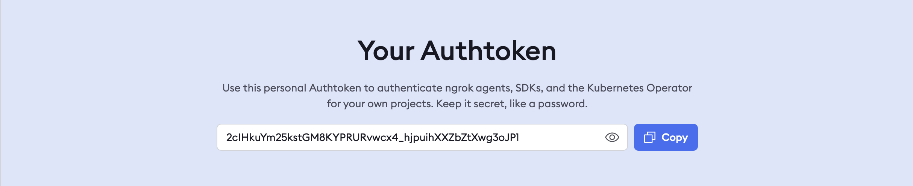
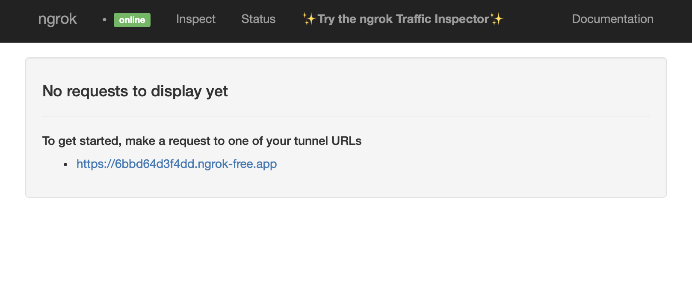
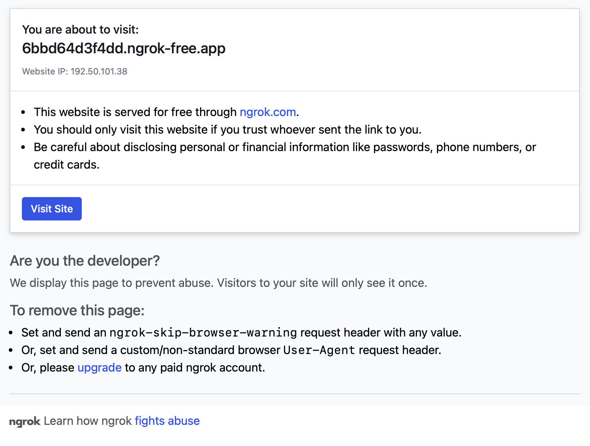

# 開発環境構築

**作成日**：2025年9月8日(月)  
**更新日**：2025年9月23日(火)  
**作成者**：泉知成 (@Tomopu)

本番デモ用の環境は Docker Compose を使って構築します。`compose.yaml` が共通サービス、`compose.prod.yaml` が本番向けの上書き設定（本番ビルドの Dockerfile・Gunicorn・ngrok など）です。以下の手順に従ってセットアップしてください。

### 1. 必要なツールを準備する
- Docker Engine / Docker Desktop（Compose v2 が同梱されているバージョン）
  - [Download Docker Desktop (macOS / Windows)](https://www.docker.com/products/docker-desktop/)
  - [Install Docker Engine on Ubuntu](https://docs.docker.com/engine/install/ubuntu/)
- `docker compose` コマンドが利用できることを確認します。

### 2. リポジトリを取得する
以下のコマンドを実行して、リモートリポジトリ(本システム)をローカル環境にクローンしてください。
```bash
git clone https://github.com/Engineer-Guild-Hackathon/team-12-app.git
cd team-12-app
```

### 3. ngrokの準備
次に、ローカルPC上で稼働しているネットワークサービスを一時的に外部公開するために、**ngrok** の設定を行います。
ダウンロードしたリポジトリ(ディレクトリ)に移動します。
```bash
cd team-12-app
```
次に、ローカルPC上で稼働しているネットワークサービスを一時的に外部公開するために、**ngrok** の設定を行います。
以下のURLにアクセスをして ngrok のアカウントを作成し、"**Your Authtoken**" に記載されたトークンをコピーしてください。
- [https://dashboard.ngrok.com/get-started/your-authtoken](https://dashboard.ngrok.com/get-started/your-authtoken)


(※ 画像に記載されている Authtoken はリセット済みのトークンです。)


### 4. 環境変数ファイルと認証情報を設定する
Compose 実行前に以下のファイル・値を用意してください。`docker compose` はルート直下の `.env` を自動で読み込みます。

1. `.env`
   - 先ほどの ngrok のダッシュボードで Authtoken を取得し、以下のように追記します。
     ```env
     NGROK_AUTHTOKEN=xxxxxxxxxxxx
     ```
   - さらに、ADC 資格情報ファイルへの絶対パスを `ADC_JSON` に設定してください（後述のファイルを指します）。
     ```env
     ADC_JSON=/absolute/path/to/adc.json
     ```

2. `backend.env`
   - `backend.env.sample` をコピーして作成し、Cloud SQL 接続情報・GCS バケット名などプロジェクト固有の値を設定します。
     ```bash
     cp backend.env.sample backend.env
     # 必要な値 (GCP_PROJECT, DB_NAME, DB_USER, GCS_BUCKET, PROJECT_ID, SECRET_ID, VERSION_ID など) を編集
     ```

3. `frontend.env`
   - フロントエンドの環境変数です。`frontend.env.sample` をコピーして作成し、必要に応じて API やオリジン URL を更新してください。例：
     ```bash
        cp frontend.env.sample frontend.env
        # 必要に応じて値 (NEXT_PUBLIC_FB_API_KEY, NEXT_PUBLIC_BACKEND_ORIGIN, NEXT_PUBLIC_SITE_ORIGIN など) を編集
     ```
     ```env
     NEXT_PUBLIC_FB_API_KEY=...
     NEXT_PUBLIC_BACKEND_ORIGIN=http://localhost:5001
     NEXT_PUBLIC_SITE_ORIGIN=http://localhost:3000
     ```

4. `service_account.json`
   - GCP サービスアカウントのキーファイルをルート直下に配置します。これは、Cloud Storage の画像の署名付きURLを発行するために使用されます。
   - 同じファイル、もしくは別途用意した ADC ファイルを `ADC_JSON` でマウントするため、パスが正しいか確認してください。

5. `ngrok.yml`
   - 既存の設定で front-app (3000 番) をトンネリングします。必要に応じてホスト名などを変更してください。

### 5. コンテナを起動する
Docker Desktop（macOS/Windows の場合）を起動した状態で以下を実行します。初回はビルドが走るため数分かかる場合があります。
```bash
docker compose -f compose.yaml -f compose.prod.yaml up -d --build
```

起動後に状態を確認します。
```bash
docker compose ps
```
`front-app`、`back-server`、`ngrok-server` の `STATUS` が `Up` であれば正常です。ログを確認したい場合は次を利用してください。
```bash
docker compose logs -f back-server front-app
```

### 6. アクセス方法
ngrok のダッシュボードは、[http://localhost:4040](http://localhost:4040) にアクセスすると確認することができます。

`"To get started, make a request to one of your tunnel URLs"` という項目の下に、本システムのサイトページにアクセスするための URL がランダムに生成されています。(例：`https://6bbd64d3f4dd.ngrok-free.app`)

このランダムに生成されたURLを他の人に共有することで、誰でもサイトのページにアクセスすることができます。



リンクにアクセスをすると以下の画面が表示されるため、[**Visit Site**]を押すことでサイトを表示することができます。



### 7. コンテナの停止と削除
デモ終了後は以下でコンテナとネットワークを停止・削除します。
```bash
docker compose -f compose.yaml -f compose.prod.yaml down
```
再度起動したい場合は「4. コンテナを起動する」からやり直してください。